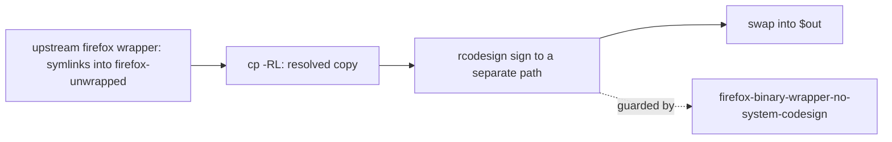

# firefox-binary-wrapper: sign the Firefox.app bundle with rcodesign (sandbox-safe)

**Status**: Accepted
**Date**: 2026-10-03
**Deciders**: Phillip Green II
**Bead**: pg2-inqwy (follow-up of pg2-wyrzi)

## Context

`overlays/firefox-binary-wrapper.nix` swaps nixpkgs' `makeWrapper` (a bash script) for `makeBinaryWrapper`
(a compiled binary) so macOS attributes camera/microphone permission to Firefox instead of `bash`
(pg2-1h7c, 2026-03-12). A second step then re-signs the `.app` bundle. Git history and the original
commit say why:

- phillipgreenii-nix-personal `c408fe3` (2026-03-12, pg2-1h7c): "codesign the .app bundle so macOS binds
  Info.plist and sealed resources (firefox.icns, bundle ID) to the wrapper binary. Without this, TCC
  shows a generic executable icon."
- The step shells out to the host's `/usr/bin/codesign`, which is not visible in a nix build sandbox, so
  the overlay only built with `sandbox = false`. nixpkgs' sigtool `codesign` was tried (`c7cb263`) and
  reverted (`35c95f5`): it signs bare Mach-O files only and throws `SigTool::NotAMachOFileException` on a
  bundle.

pg2-wyrzi (phillipgreenii-nix-support-apps ADR 0046) moved `pg-osx-bridge-api` to `rcodesign`, and
recorded that the Firefox bundle is not a drop-in swap.

## Acceptance criterion

Derived from the history above (the only recorded purpose of the signature), plus the verification the
bead requires. The signed `Firefox.app` MUST satisfy all of:

| #   | Requirement                                                                                      | Evidence source            |
| --- | ------------------------------------------------------------------------------------------------ | -------------------------- |
| A1  | The main executable is the compiled binary wrapper and the bundle carries a code signature       | `c408fe3`, pg2-1h7c design |
| A2  | `Info.plist` is bound into the signature, and the signing identifier equals `CFBundleIdentifier` | `c408fe3` ("bundle ID")    |
| A3  | `firefox.icns` (and the other bundle resources) are sealed by content hash in `CodeResources`    | `c408fe3` ("firefox.icns") |
| A4  | `codesign --verify --strict` (and `--deep`) passes on the build OUTPUT, run outside the build    | pg2-inqwy step 3           |
| A5  | The build succeeds with `sandbox = true` and never references the host's system `codesign`       | pg2-inqwy step 4, ADR 0046 |

A1 to A3 are the properties that, per `c408fe3`, make the TCC prompt show the Firefox icon and bundle ID.
Whether TCC really shows the Firefox icon can only be seen on the live machine after an apply; this ADR
does not claim it (see Consequences).

## Evaluation

Measured on aarch64-darwin, 2026-10-03, against this flake's pinned `nixpkgs`: `rcodesign` 0.29.0
(`pkgs.rcodesign`), `firefox` 156.0.1.

Why the old signature never verified: `Contents/{MacOS,Resources,...}` entries of the wrapper bundle are
symlinks into the read-only `firefox-unwrapped` store path (48 symlinks in the bundle).
`/usr/bin/codesign --force --sign -` sealed them as symlinks and the result fails
`codesign --verify --strict` with `Too many levels of symbolic links`. `rcodesign sign` in place fails with
`Permission denied (os error 13)` because it writes through the symlinks. `rcodesign sign --shallow`
leaves an invalid sealed resource directory. What works: copy the bundle with every symlink resolved
(`cp -RL`), sign that copy to a separate output path, swap it into `$out`.

| Property                            | Old (`/usr/bin/codesign`, symlinked)     | New (`rcodesign`, resolved copy)             |
| ----------------------------------- | ---------------------------------------- | -------------------------------------------- |
| Identifier                          | `org.nixos.firefox`                      | `org.nixos.firefox`                          |
| Format                              | app bundle with Mach-O thin (arm64)      | app bundle with Mach-O thin (arm64)          |
| Signature / flags                   | `adhoc`, `flags=0x2(adhoc)`              | `adhoc`, `flags=0x2(adhoc)`                  |
| Info.plist                          | bound, `entries=37`                      | bound, `entries=37`                          |
| Sealed resources                    | version 2, rules=13, files=71            | version 2, rules=13, files=71                |
| `firefox.icns` in seal              | sealed as a symlink                      | sealed by content hash (real file)           |
| Designated requirement              | `cdhash H"..."`                          | `cdhash H"..."`                              |
| symlinks left in the bundle         | 48                                       | 0                                            |
| `codesign --verify --strict`        | fails: Too many levels of symbolic links | valid on disk, satisfies its Designated Req. |
| `codesign --verify --deep --strict` | fails                                    | passes                                       |
| Builds with `sandbox = true`        | no (needs the host path)                 | yes (`nix build --option sandbox true`)      |

Consequences of resolving the links for the output: the bundle no longer references `firefox-unwrapped`
(store references drop to `libresolv`, `krb5`, `libiconv`, `cups`, `ffmpeg`), and the resolved resources
are real files in the `firefox` output (about 348 MiB for the `.app`, of which `XUL` was already a real
copy).

## Decision

- The overlay MUST sign the bundle with `rcodesign sign <resolved-copy> <separate-output>` and MUST
  resolve symlinks into real files first (`cp -RL`).
- The overlay MUST NOT invoke the host's system `codesign`; its build MUST succeed with `sandbox = true`.
- The flake check `firefox-binary-wrapper-no-system-codesign` MUST fail if the overlay's `buildCommand`
  references the host path or contains no `rcodesign sign` step. It inspects the script text at eval time
  and never realizes the Firefox closure, like `firefox-binary-wrapper-eval`.
- The signature MUST stay ad hoc. A stable identity (so TCC grants survive rebuilds) is a separate
  decision, as in ADR 0046.

## Consequences

- `nix build` of the overlay'd Firefox no longer depends on a non-sandbox host path.
- The signature is verifiable for the first time (A4).
- The ad hoc designated requirement is a `cdhash` that changes with every rebuild, as it did before, so
  no TCC grant that survived a rebuild can be lost by this change; the first apply after it is one more
  rebuild.
- NOT verified here (needs the live machine after an apply; Firefox was not installed or launched and
  TCC was not touched): that Firefox launches from the re-signed bundle, and that the TCC prompt shows
  the Firefox icon and bundle ID (A1 to A3 are the properties that should give that, per `c408fe3`).

